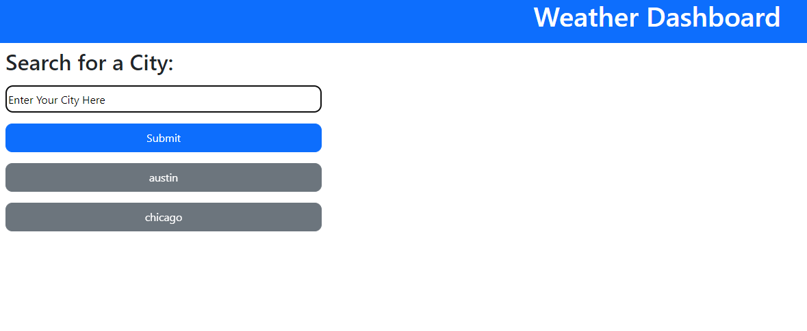
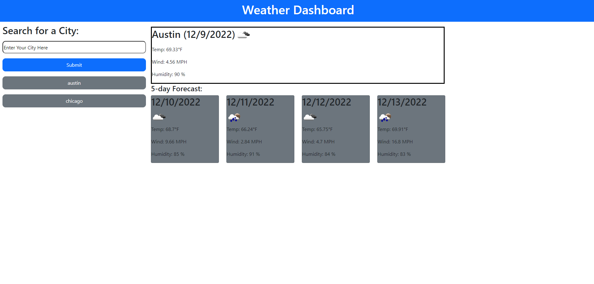

# Weather-Dashboard

## Description

The motivation for this application was to build an app that utilizes Open Weather Map's API to generate current and future weather conditions for any given searched area. I built this to practice generating HTML elements using javascript and utilize a web API to get information based on a user's query. It solves the problem of being able to get up-to-date information on the day's weather and future conditions so a user can plan their life accordingly based on the forecasts. I learned how to utilize different API requests and parse through the responses to generate content that can be seen and interacted with on the page.

## Installation

No installation required. Access the application in any browser at https://jeremyskinner812.github.io/weather-dashboard/

## Usage

- To use Weather-Dashboard go to https://jeremyskinner812.github.io/weather-dashboard/ in any web browser. Enter your city, location, or any other location into the search field and click the submit button below. 

- Your results will appear on the right with a large display of the current day's weather and the 5-day forecast on smaller cards below. Previously searched locations will appear below the search form and can be clicked on to review the previously searched location's updated forecast.

## Credits

- Days.js plugin
- Bootstrap CSS Framework
- Open Weather Map API

